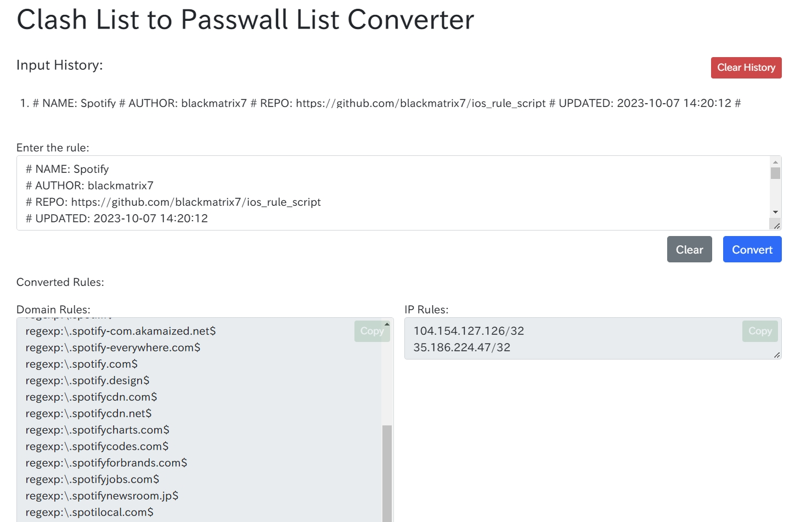

# JooJump

PS：由于网络环境越来越差，建议直接国内IP直连，其他代理即可

译名：笨猪跳

「老婆和女朋友」列表

如果链接返回404，证明你的头顶绿了

## Clash.ini

自用 Clash 基础配置，用于 subconvertor 转换为真正的 Clash 配置文件

## Clash List 转 Passwall（v2ray/Xray）分流规则

[点此前往](https://benzbrake.github.io/JooJump/tools/clash-list-to-passwall.html)，静态网页，另存为本地文件也是能用的。

使用 Passwall 分流的时候想找合适的规则不好找，就做了一个 Clash List 转 Passwall 分流规则的网页，填写 Clash 格式的 List 就可以输出相应的域名和 IP 列表。

